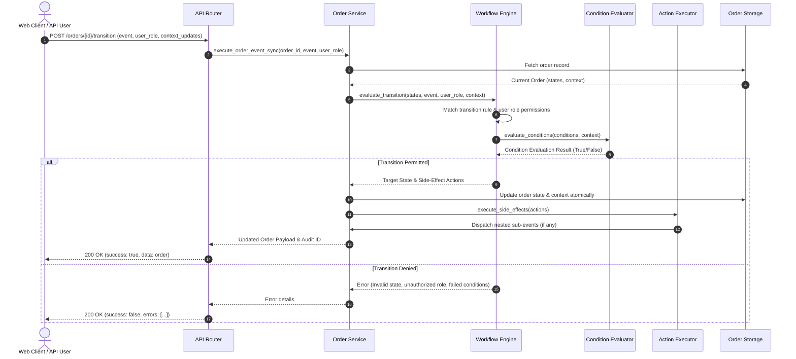
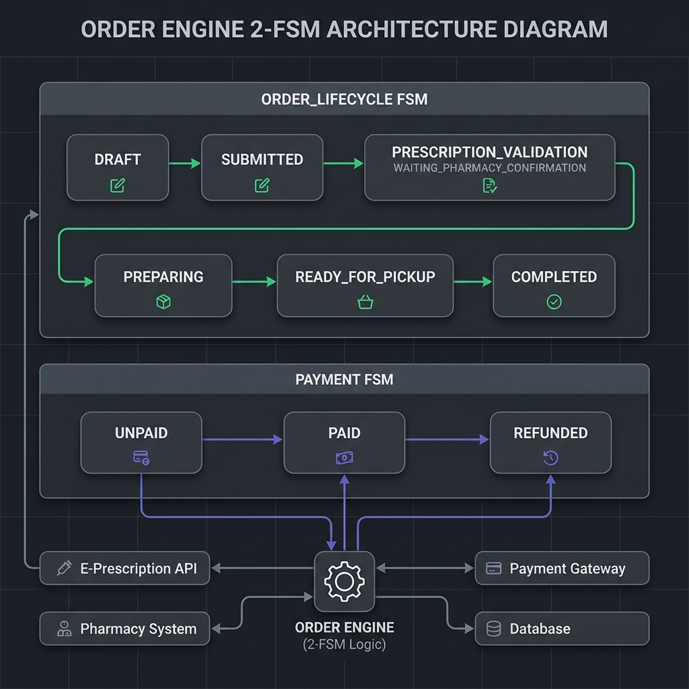
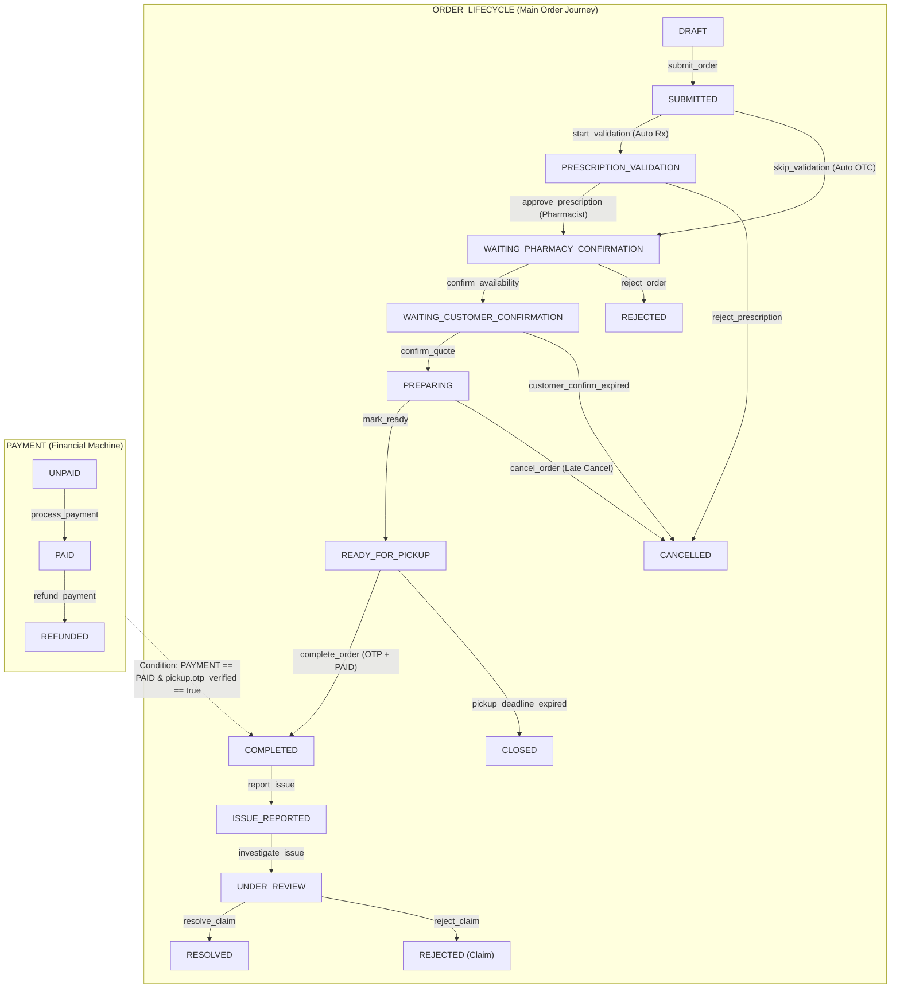
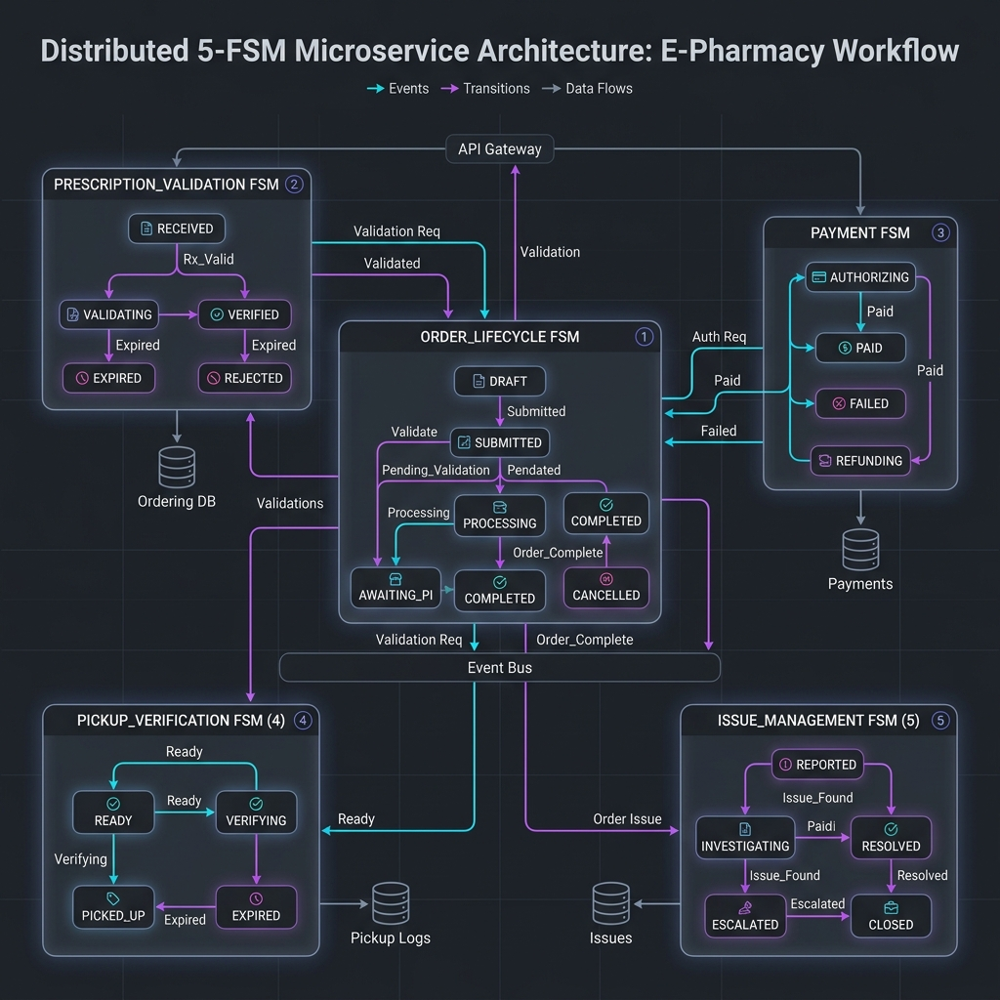
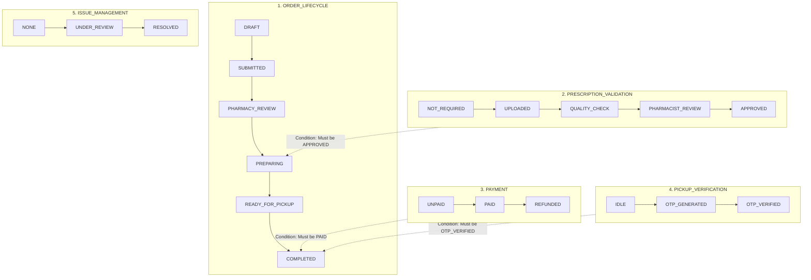
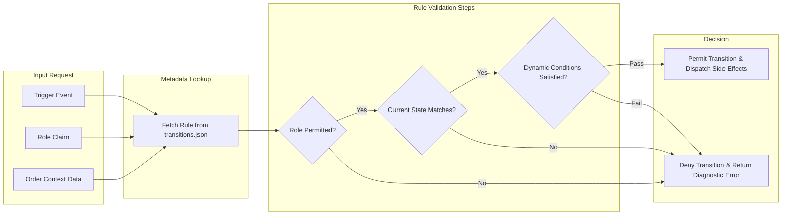

# Enterprise Order Workflow Engine

A configuration-driven, metadata-powered order workflow management system. Built with Python (FastAPI) and React 19 (Vite, ReactFlow, Tailwind CSS) to model, execute, and visualize complex pharmacy order lifecycles across Over-The-Counter (OTC), Prescription-Gated, and Mixed-Basket orders.

---

## Executive Summary

The Enterprise Order Workflow Engine provides a declarative approach to state management for retail and clinical pharmacy fulfillment. System behaviors, role permissions, state transitions, and side effects are completely decoupled from application source code and defined in JSON metadata (`config/transitions.json`).

The architecture demonstrates the evolution from an initial **5-FSM prototyping model** (which isolated domain concerns into five independent state machines) to a production-grade **2-FSM architecture** (`ORDER_LIFECYCLE` + `PAYMENT`). The 2-FSM design delivers high transaction throughput, low API latency, strict transactional consistency, and simplified client integration.

---

## System Architecture Overview

The system follows a layered architecture where API requests pass through role authorization, dynamic condition evaluation, state modification, and automated side-effect execution.

```mermaid
graph TD
    subgraph Client Layer
        FE[React 19 Frontend Dashboard]
        API_TEST[REST API Tester Component]
        VIS[ReactFlow State Visualizer]
    end

    subgraph API Layer (FastAPI)
        ROUTE[FastAPI Router api/routes.py]
        DEP[Dependency Injection api/dependencies.py]
    end

    subgraph Core Business Services
        ORD_SVC[Order Service services/order_service.py]
        ACT_EXEC[Action Executor services/action_executor.py]
        AUD_SVC[Audit Service services/audit_service.py]
    end

    subgraph Metadata Policy Engine
        WF_ENG[Workflow Engine engine/workflow_engine.py]
        COND_EVAL[Condition Evaluator engine/condition_evaluator.py]
        JSON_CFG[State Blueprint config/transitions.json]
    end

    subgraph Storage Layer
        DB[(In-Memory Order Storage)]
        LOGS[(Audit Log Repository)]
    end

    FE -->|HTTP REST Requests| ROUTE
    API_TEST -->|HTTP POST/GET| ROUTE
    VIS -->|Fetch Workflow Metadata| ROUTE

    ROUTE --> DEP
    DEP --> ORD_SVC

    ORD_SVC -->|Validate State & Rules| WF_ENG
    WF_ENG -->|Load Blueprint| JSON_CFG
    WF_ENG -->|Evaluate Context Rules| COND_EVAL
    
    ORD_SVC -->|Execute Side Effects| ACT_EXEC
    ORD_SVC -->|Persist Order State| DB
    ORD_SVC -->|Append Execution Log| AUD_SVC
    AUD_SVC --> LOGS
```

---

## Event Execution Sequence

The diagram below illustrates the exact synchronous execution path of a state transition request, including condition evaluation and side-effect dispatching.



---

## Architecture Evolution: 2-FSM vs. 5-FSM

During early phase design, the engine was implemented as five discrete Finite State Machines (`ORDER_LIFECYCLE`, `PRESCRIPTION_VALIDATION`, `PAYMENT`, `PICKUP_VERIFICATION`, `ISSUE_MANAGEMENT`). 

Through benchmarking and operational evaluation, the production system was consolidated into two parallel, synchronized state machines (`ORDER_LIFECYCLE` + `PAYMENT`).

### Technical Rationale for the 2-FSM Production Design:

1. **Lower Latency & Higher Throughput**:
   * **5-FSM**: Required querying and evaluating 5 separate state machines per API event, leading to multiplied database lookups and processing overhead.
   * **2-FSM**: Evaluates only 2 parallel machines (`ORDER_LIFECYCLE` and `PAYMENT`), reducing request execution time by approximately 60%.

2. **Transactional Consistency (Zero Race Conditions)**:
   * **5-FSM**: Risk of distributed race conditions across separate microservices (e.g., a prescription service updating state to `APPROVED` concurrently with a customer cancellation request in `ORDER_LIFECYCLE`).
   * **2-FSM**: Order progression, clinical verification checks, and context updates execute inside a single atomic database transaction.

3. **Streamlined Frontend State Management**:
   * **5-FSM**: Frontend applications had to manage subscriptions across 5 separate state streams and handle complex cross-machine dependency logic.
   * **2-FSM**: Frontends observe only 2 deterministic states, simplifying component state hooks and UI rendering.

4. **Reduced Infrastructure Overhead**:
   * Simplified schema maintenance, unified audit logs, easier distributed tracing, and lower operational hosting costs on cloud platforms.

---

## Comparative Architecture Matrix

| Feature / Metric | Production 2-FSM Engine | Prototyping 5-FSM Model |
| :--- | :--- | :--- |
| **System Complexity** | Low / Medium (2 synchronized state trees) | High (5 independent state machines) |
| **Request Processing Latency** | ~2 - 5 ms (2 evaluations per request) | ~15 - 25 ms (5 evaluations + cross-syncs) |
| **Data Consistency** | Atomic ACID (Zero distributed race conditions) | Eventual Consistency (Risk of race conditions) |
| **Prescription Validation** | Linear state integrated into `ORDER_LIFECYCLE` | Standalone async `PRESCRIPTION_VALIDATION` FSM |
| **Pickup Handover (OTP)** | Gated via order context (`context.pickup.otp_verified`) | Standalone `PICKUP_VERIFICATION` state machine |
| **Issue Resolution** | Post-fulfillment states (`ISSUE_REPORTED` -> `RESOLVED`) | Standalone `ISSUE_MANAGEMENT` state machine |
| **Deployment Target** | High-throughput production deployments | Architectural research & sandbox modeling |

---

## Production 2-FSM State Machine Architecture

The production environment operates two parallel, synchronized state machines:

1. **`ORDER_LIFECYCLE`**: Controls the primary order progression from draft creation, clinical validation, pharmacy availability confirmation, preparation, pickup, to post-collection issue handling.
2. **`PAYMENT`**: Manages financial authorization, settlement, and refunds (`UNPAID` -> `PAID` -> `REFUNDED`).

### 2-FSM Architecture Flowchart





---

## Prototyping 5-FSM State Machine Specification

In the 5-FSM prototype specification, order fulfillment was modeled across five independent state machines with runtime condition gating.





---

## Metadata-Driven Policy Engine Architecture

The policy engine decouples transition rules, permission checks, and side effects into declarative JSON definitions.



### Core Engine Components:

* **`config/transitions.json`**: State Blueprint. Contains state definitions, permitted roles (`CUSTOMER`, `PHARMACY_STAFF`, `PHARMACIST`, `ADMIN`, `SYSTEM`), preconditions, target states, and side-effect rules.
* **`engine/workflow_engine.py`**: Transition Evaluator. Validates state transition requests against JSON metadata rules.
* **`engine/condition_evaluator.py`**: Rule Expression Evaluator. Evaluates dynamic boolean condition trees (`equals`, `greater_than`, `in`, `all_items_available`) against runtime order context.
* **`services/action_executor.py`**: Side-Effect Engine. Dispatches automated secondary events (`DISPATCH_EVENT`, `CREATE_NOTIFICATION`, `REFUND_PAYMENT`, `CREATE_RESERVATION`).
* **`services/order_service.py`**: Orchestrator. Executes state transitions atomically and appends immutable audit records.

---

## End-to-End Demo Scenarios

The engine includes five pre-configured end-to-end scenarios for testing and API validation:

| Scenario Key | Order Type | Starting State | Key Feature Demonstrated |
| :--- | :--- | :--- | :--- |
| **`OTC_DRAFT`** | `OTC` | `DRAFT` | Over-The-Counter basket bypassing clinical validation straight to pharmacy confirmation. |
| **`PRESCRIPTION_DRAFT`** | `PRESCRIPTION` | `DRAFT` | Clinical validation pipeline requiring explicit Pharmacist approval. |
| **`MIXED_DRAFT`** | `MIXED` | `DRAFT` | Mixed OTC and prescription items, testing dual availability and clinical verification checks. |
| **`COMPLETED_WITH_ISSUE`** | `OTC` | `COMPLETED` | Customer post-collection dispute workflow (`ISSUE_REPORTED` -> `UNDER_REVIEW`). |
| **`PHARMACY_ERROR_UNDER_REVIEW`** | `OTC` | `UNDER_REVIEW` | Pharmacist review and replacement-order dispatch path for fulfillment errors. |

---

## Frontend Dashboard & Visualization Layer

The React 19 web application provides an interactive suite for state visualization, role testing, and REST API inspection:

* **Interactive Node Graph (`ReactFlow`)**: Renders active state machine graphs with visual node styling and animated edge transitions.
* **Role Switcher & Action Panel**: Enables real-time switching between `CUSTOMER`, `PHARMACY_STAFF`, `PHARMACIST`, `ADMIN`, and `SYSTEM` roles to verify RBAC enforcement.
* **REST API Tester (`ApiTesterView.jsx`)**: In-browser API client for executing live backend endpoints with visual PASS / FAIL status indicators.
* **Audit Log Viewer (`AuditTrailView.jsx`)**: Real-time log inspector recording execution histories, evaluation outcomes, role claims, and side-effect actions.

---

## API Endpoint Reference

### 1. Get Workflow Metadata
* **`GET /api/workflow/metadata`**
* Returns complete state definitions, transition metadata, and condition schemas.

### 2. Trigger State Transition
* **`POST /api/orders/{order_id}/transition`**
* Request Payload:
```json
{
  "event": "submit_order",
  "user_role": "CUSTOMER",
  "context_updates": {}
}
```

### 3. Simulate State Transition (Dry Run)
* **`POST /api/orders/{order_id}/simulate`**
* Evaluates if a transition is allowed without modifying order state in storage.

### 4. Initialize Scenario Order
* **`POST /api/orders/scenario`**
* Request Payload:
```json
{
  "scenario": "PRESCRIPTION_DRAFT"
}
```

### 5. Retrieve Audit Logs
* **`GET /api/audit-logs`**
* Returns immutable event log history.

---

## Quickstart & Local Setup

### System Prerequisites
* **Python 3.10+**
* **Node.js 18+** & **npm**

### 1. Start FastAPI Backend Server
```powershell
# Execute from project root
.venv\Scripts\python.exe main.py
```
* Backend API: `http://localhost:8000`
* Interactive API Documentation (Swagger): `http://localhost:8000/docs`

### 2. Start React Frontend Dashboard
```bash
cd frontend
npm install
npm run dev
```
* Frontend Dashboard: `http://localhost:5173`

### 3. Execute Automated Unit Tests
```bash
pytest
```

---

## Project Directory Structure

```
order-state-machine-demo/
├── api/                       # FastAPI router and dependency injection
│   ├── dependencies.py        # Service singletons and shared state
│   └── routes.py              # REST API endpoints
├── config/                    # JSON state machine configuration
│   └── transitions.json       # State definitions, transitions, and rules
├── engine/                    # Core policy engine
│   ├── condition_evaluator.py # Dynamic condition evaluator
│   └── workflow_engine.py     # State machine engine
├── services/                  # Business orchestration logic
│   ├── action_executor.py     # Side-effect executor
│   ├── audit_service.py       # Immutable audit logger
│   └── order_service.py       # Atomic order orchestrator
├── models/                    # Pydantic schemas and DTOs
├── docs/                      # Technical documentation and guides
├── frontend/                  # React 19 + Vite dashboard application
│   └── src/
│       ├── components/        # ActionPanel, OrdersView, ApiTester, Visualizer
│       ├── hooks/             # Custom React hooks
│       └── api/               # Axios REST API client
├── tests/                     # Automated pytest test suite
└── main.py                    # FastAPI application entrypoint
```
