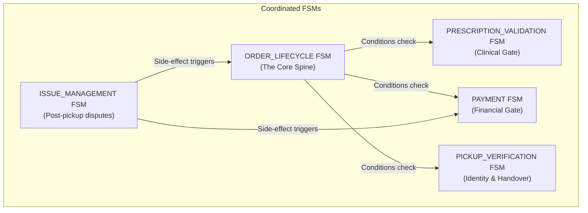
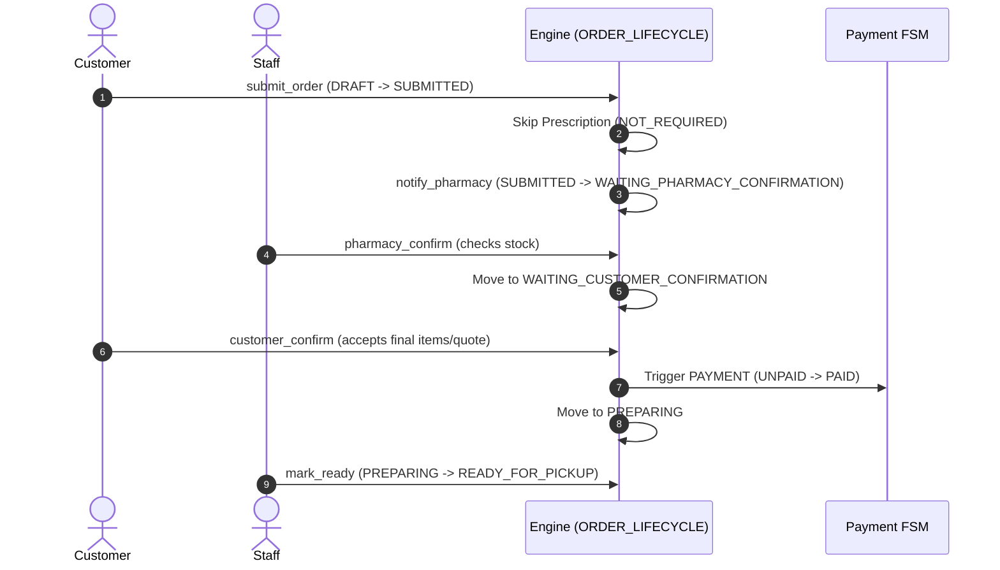
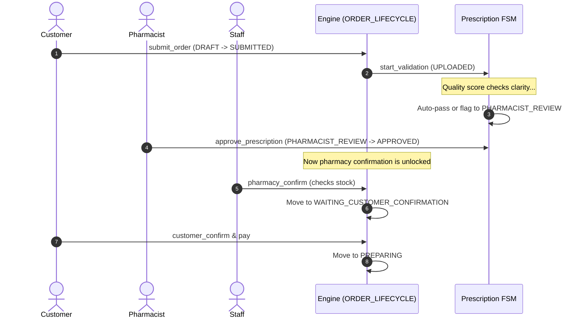

# MediPick Coordinated FSM Architecture Guide

This document explains the architecture of the MediPick Order State Machine, detailing why the system is split into five independent, coordinated Finite State Machines (FSMs) rather than one monolithic state machine, how they synchronize, and the reasoning behind each process flow.

---

## 1. Architectural Strategy: Split FSMs vs. Monolithic FSM

In many workflow engines, developers model order lifecycles as a single monolithic state machine. However, in a complex healthcare/pharmacy pickup application like MediPick, this leads to **state explosion**.

### What is State Explosion?
If we combine the Order Lifecycle, Payment status, Prescription Validation, and Pickup handovers into a single state machine, we must create unique states representing every possible combination of conditions. For example:
* `WAITING_PICKUP_AND_PAID_AND_PRESCRIPTION_APPROVED`
* `WAITING_PICKUP_AND_UNPAID_AND_PRESCRIPTION_APPROVED`
* `PREPARING_AND_PAID_AND_PRESCRIPTION_UNDER_REVIEW`
* `READY_FOR_PICKUP_AND_PAID_AND_PRESCRIPTION_APPROVED_WITH_LATE_CANCEL`

With just a few states in each sub-domain, the total number of combined states grows exponentially (e.g., $9 \text{ (Order)} \times 4 \text{ (Payment)} \times 6 \text{ (Prescription)} \times 4 \text{ (Pickup)} = 864$ possible states). Maintaining transitions between hundreds of monolithic states is impossible.

### The Solution: Coordinated FSMs
MediPick separates concerns into **five independent, decoupled workflows** that run in parallel on a single order entity.



Each FSM owns a specific business domain, making it simple to write, test, and update:
1. **`ORDER_LIFECYCLE`**: The spine that tracks the physical progress of the order (Draft ➔ Submitted ➔ Preparing ➔ Ready ➔ Completed).
2. **`PRESCRIPTION_VALIDATION`**: Handles OCR checking, clarity scoring, and human pharmacist review.
3. **`PAYMENT`**: Manages money states (`UNPAID`, `PAID`, `REFUNDED`).
4. **`PICKUP_VERIFICATION`**: Governs OTP generation, customer counter check-in, and handovers.
5. **`ISSUE_MANAGEMENT`**: Post-completion resolution (returns, refunds, replacement orders).

---

## 2. Coordination & Gates (Dynamic Condition Matching)

Instead of hardcoding relationships in Python, the workflows coordinate using **Dynamic Conditions** configured in `config/transitions.json`. A state machine transitions only if its conditions (evaluated by `ConditionEvaluator`) are met.

For example, when a pharmacy staff member tries to transition `ORDER_LIFECYCLE` from `WAITING_PHARMACY_CONFIRMATION` to `PREPARING` via `pharmacy_confirm`, the engine evaluates this guard:

```json
"conditions": [
  {
    "path": "states.PRESCRIPTION_VALIDATION",
    "operator": "in",
    "value": ["APPROVED", null]
  }
]
```
If the order requires a prescription, and `PRESCRIPTION_VALIDATION` is not yet `APPROVED`, the transition is blocked.

---

## 3. Order Flow Lifecycles

### OTC (Over-the-Counter) Order Sequence
For orders containing only OTC items, the system automatically marks prescription validation as `NOT_REQUIRED`.



### Prescription/Mixed Order Sequence
If prescription items are present, the order must pass the clinical review stage.



---

## 4. Why This Specific Flow? (Business Rules Rationale)

1. **Why do we have `WAITING_CUSTOMER_CONFIRMATION` before `PREPARING`?**
   * **Inventory & Substitutions:** Physical stock may differ from digital data. If items are out of stock or brand substitutes are required, the pharmacy staff edits the order. The customer must approve the new quote before preparation begins, preventing wasted pharmacy effort and customer frustration.
   * **Checkout Preference:** The customer can toggle the `accept_substitutes` checkout preference. While this preference shows the pharmacy staff they are permitted to replace out-of-stock items, the customer still approves the final proposal at this step before paying.

2. **Why does `payment` happen before `PREPARING`?**
   * Pre-paying prevents "no-show" losses. Preparing customized items (especially prescription medications that might require decanting or clinical assembly) takes pharmacist time. Ensuring the order is paid first reduces empty labor.

3. **Why does `PICKUP_VERIFICATION` require a separate FSM?**
   * Medicine pickup is legally sensitive. Handing drugs to the wrong person is a severe health violation. OTP verification ensures the customer standing at the counter matches the one who submitted the order. Keeping this logic in a separate FSM makes it easy to add future methods (e.g., identity card scans).

4. **Why is `ISSUE_MANAGEMENT` separate?**
   * Once an order reaches `COMPLETED`, the order lifecycle is terminal. To handle disputes (e.g., incorrect dosage, damaged items), the `ISSUE_MANAGEMENT` workflow starts a post-sale claim. If resolved as a pharmacy-side error, it automates a refund on the `PAYMENT` workflow and dispatches a `CREATE_REPLACEMENT_ORDER` action to clone and recreate the order.
