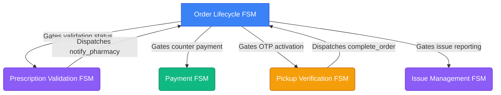
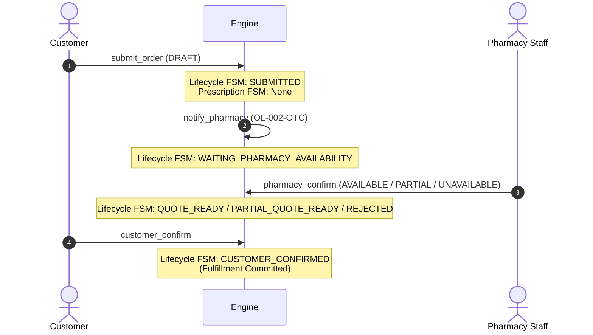
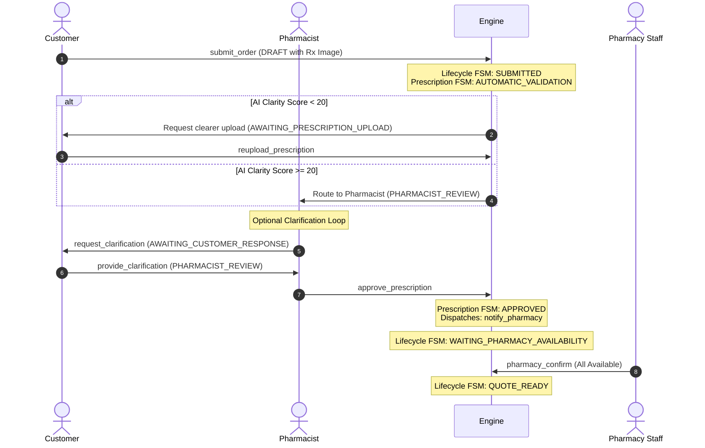

# MediPick Order Flows & Scenarios Guide

This document serves as the guide for the MediPick Order State Machine system. It defines how Over-the-Counter (OTC), Prescription (Rx), and Mixed orders are handled by the backend engine across five coordinated Finite State Machines (FSMs).

---

## 1. Coordinated State Machine Architecture

MediPick uses **five independent, loosely coupled state machines** that coordinate using cross-workflow state gates (guarded transition conditions) and dispatch actions:

---

## 2. Order Types & Flow Mechanics

### A. Over-the-Counter (OTC) Orders
OTC orders bypass clinical validation. The workflow proceeds immediately to pharmacy availability evaluation.

1. **Submission**: Order starts at `DRAFT` (no prescription validation active). Customer triggers `submit_order`. The lifecycle moves to `SUBMITTED`.
2. **Auto-Notification**: Because there is no prescription, the engine fires `notify_pharmacy` automatically, matching rule `OL-002-OTC` (`order_type == "OTC"`). The state transitions to `WAITING_PHARMACY_AVAILABILITY`.
3. **Fulfillment Assessment**: Pharmacy staff checks the shelves and updates the order's items manually. If items are unavailable, they update the `availability_result`. The engine recalculates `availability.status`.
4. **Pharmacy Confirmation**: Staff calls `pharmacy_confirm`.
   - If `AVAILABLE` ➔ `QUOTE_READY`.
   - If `PARTIAL` ➔ `PARTIAL_QUOTE_READY`.
   - If `UNAVAILABLE` ➔ `PHARMACY_REJECTED` (terminal).
5. **Checkout**: The customer confirms the quote (`customer_confirm`), indicating acceptance of the pharmacy's availability response and moving the lifecycle to `CUSTOMER_CONFIRMED`.

---

### B. Prescription (Rx) Orders
Prescription orders must pass clinical validation by a licensed pharmacist before the pharmacy staff evaluates availability.

1. **Submission**: Cart submission sets `ORDER_LIFECYCLE` to `SUBMITTED`, initializes the prescription validation state to `SUBMITTED`, and automatically triggers `start_validation` on the `PRESCRIPTION_VALIDATION` FSM, landing it at `AUTOMATIC_VALIDATION`.
2. **AI Scan**:
   - Clarity score **< 20** (or bad upload/illegible document): Transitions to `AWAITING_PRESCRIPTION_UPLOAD`. The order is locked until the customer uploads a new image (`reupload_prescription`).
   - Clarity score **>= 20**: Transitions to `PHARMACIST_REVIEW`.
3. **Pharmacist Review**:
   - **Clarification Loop**: If handwritten text is ambiguous, the pharmacist triggers `request_clarification` (moves to `AWAITING_CUSTOMER_RESPONSE`). The customer responds (`provide_clarification`) to return the state to `PHARMACIST_REVIEW`.
   - **Approval**: Pharmacist calls `approve_prescription`. This transitions `PRESCRIPTION_VALIDATION` to `APPROVED` and dispatches a background `notify_pharmacy` event.
   - **Rejection**: Pharmacist calls `reject_prescription`. This transitions `PRESCRIPTION_VALIDATION` to `REJECTED` (terminal). The order cannot proceed.
4. **Availability Evaluation**: The dispatched `notify_pharmacy` event matches rule `OL-002-RX` (requires `PRESCRIPTION_VALIDATION == APPROVED`) and transitions the main lifecycle to `WAITING_PHARMACY_AVAILABILITY`. From this point, it follows the OTC flow.

---

### C. Mixed Orders
Mixed orders contain both OTC items and prescription-only medicines. They follow the exact clinical gating flow of Prescription Orders:

1. **Prescription approval is mandatory first**. The order lifecycle is locked in `SUBMITTED` and cannot move to `WAITING_PHARMACY_AVAILABILITY` until `PRESCRIPTION_VALIDATION` transitions to `APPROVED`.
2. **Consolidated Quote**: Once clinical approval is obtained, the pharmacy staff checks the availability of *both* the OTC items and the prescription medicines. 
3. **Partial Quote Options**: If the OTC items are in stock but the prescription medicine is out of stock (or vice-versa), the system calculates `availability.status` as `PARTIAL` and serves a `PARTIAL_QUOTE_READY` quote to the customer.

---

## 3. Post-Approval Operations & Edge Cases

### A. Preparation & Handover sequence
Once the customer approves a quote, the preparation and collection workflow begins:

1. **Preparation**: Staff triggers `start_preparing` ➔ `PREPARING_ORDER`.
2. **Packaging complete**: Staff triggers `mark_ready` ➔ `READY_FOR_PICKUP`.
   - *Backend Actions*:
     - Sets a 48-hour pickup deadline in `pickup.deadline`.
     - Dispatches `activate_pickup` to the `PICKUP_VERIFICATION` FSM, moving it from `NOT_READY` to `READY_FOR_PICKUP`.
3. **Payment**:
   - The customer can pay online (`make_payment` ➔ `PAYMENT_PENDING` ➔ `PAID`).
   - Alternatively, they can pay at the counter when they arrive (`pay_at_counter` ➔ `PAID`, only allowed if `ORDER_LIFECYCLE == READY_FOR_PICKUP`).
4. **Counter Verification**:
   - Customer arrives: Staff triggers `customer_arrive` ➔ `CUSTOMER_ARRIVED`.
   - OTP confirmation: Staff triggers `verify_otp` ➔ `IDENTITY_VERIFIED`.
   - Handover: Staff triggers `complete_handover`. 
     - **Gate**: Requires `PAYMENT == PAID`.
     - *Actions*: Transitions `PICKUP_VERIFICATION` to `COLLECTED` and dispatches `complete_order`, which moves the main lifecycle to `COLLECTED` (terminal).

---

### B. Late Cancellations
If a customer cancels an order after the pharmacy has committed resources:
- **During Preparation** (`PREPARING_ORDER`): Triggers warning `OL-013`. The cancellation is recorded, and the customer receives a late cancellation flag.
- **When Ready** (`READY_FOR_PICKUP`): Triggers warning `OL-014`. The cancellation is recorded, and the customer is flagged.

---

### C. No-Show Recovery
If the 48-hour deadline passes without collection:
1. **Timeout**: The system triggers `pickup_deadline_expired` ➔ `NOT_COLLECTED`.
2. **Close Order**: The order can be archived to `CLOSED`.
3. **Reopen Option**: If the customer contacts the pharmacy, staff can trigger `reopen_pickup`.
   - *Backend Actions*: Transitions the lifecycle back to `READY_FOR_PICKUP`, runs `set_context` to set a fresh 48-hour window, and dispatches `activate_pickup` to reset the OTP cycle.

---

## 4. Return and Replacement Flow (Pharmacy Error)
If there is a pharmacy error after collection:
1. **Issue Filed**: Customer files a dispute (`report_issue` ➔ `ISSUE_REPORTED`).
2. **Review**: Staff investigates (`start_investigation` ➔ `UNDER_REVIEW`).
3. **Resolution**: Pharmacist resolves the claim as a pharmacy error (`resolve_issue` ➔ `RESOLVED`).
   - *Backend Actions*:
     - Dispatches `issue_refund` to move the original `PAYMENT` FSM to `REFUNDED`.
     - Triggers action `CREATE_REPLACEMENT_ORDER`, which automatically spawns a linked copy in the database starting in `PREPARING_ORDER`, with payment pre-marked as `PAID` ($0.00 due).

---

## 5. Backend Scenarios Matrix

| Scenario Name | Order Type | Lifecycle State | Prescription State | Payment State | Pickup State | Allowed Transitions |
|---|---|---|---|---|---|---|
| **OTC_DRAFT** | `OTC` | `DRAFT` | `None` | `UNPAID` | `NOT_READY` | `submit_order`, `discard_draft` |
| **OTC_WAITING_PHARMACY** | `OTC` | `WAITING_PHARMACY_AVAILABILITY` | `None` | `UNPAID` | `NOT_READY` | `pharmacy_confirm`, `delay_order`, `cancel_order` |
| **OTC_DELAYED** | `OTC` | `PHARMACY_DELAYED` | `None` | `UNPAID` | `NOT_READY` | `resume_processing`, `cancel_order` |
| **OTC_WAITING_CUSTOMER** | `OTC` | `QUOTE_READY` | `None` | `UNPAID` | `NOT_READY` | `customer_confirm`, `cancel_order` |
| **OTC_PARTIAL_QUOTE** | `OTC` | `PARTIAL_QUOTE_READY` | `None` | `UNPAID` | `NOT_READY` | `customer_confirm`, `cancel_order` |
| **OTC_PREPARING** | `OTC` | `PREPARING_ORDER` | `None` | `UNPAID` | `NOT_READY` | `mark_ready` |
| **OTC_READY_UNPAID** | `OTC` | `READY_FOR_PICKUP` | `None` | `UNPAID` | `READY_FOR_PICKUP` | `customer_arrive`, `pay_online`, `pay_at_counter`, `cancel_order` |
| **OTC_READY_PAID** | `OTC` | `READY_FOR_PICKUP` | `None` | `PAID` | `IDENTITY_VERIFIED` | `complete_handover`, `cancel_order` |
| **OTC_COLLECTED** | `OTC` | `COLLECTED` | `None` | `PAID` | `COLLECTED` | `report_issue` |
| **PRESCRIPTION_DRAFT** | `PRESCRIPTION` | `DRAFT` | `None` | `UNPAID` | `NOT_READY` | `submit_order`, `discard_draft` |
| **PRESCRIPTION_PHARMACIST_REVIEW** | `PRESCRIPTION` | `SUBMITTED` | `PHARMACIST_REVIEW` | `UNPAID` | `NOT_READY` | `approve_prescription`, `reject_prescription`, `request_clarification` |
| **PRESCRIPTION_AWAITING_CUSTOMER** | `PRESCRIPTION` | `SUBMITTED` | `AWAITING_CUSTOMER_RESPONSE` | `UNPAID` | `NOT_READY` | `provide_clarification` |
| **PRESCRIPTION_WAITING_PHARMACY** | `PRESCRIPTION` | `WAITING_PHARMACY_AVAILABILITY` | `APPROVED` | `UNPAID` | `NOT_READY` | `pharmacy_confirm`, `delay_order`, `cancel_order` |
| **MIXED_DRAFT** | `MIXED` | `DRAFT` | `None` | `UNPAID` | `NOT_READY` | `submit_order`, `discard_draft` |
| **MIXED_PRESCRIPTION_PENDING** | `MIXED` | `SUBMITTED` | `PHARMACIST_REVIEW` | `UNPAID` | `NOT_READY` | `approve_prescription`, `reject_prescription` |
