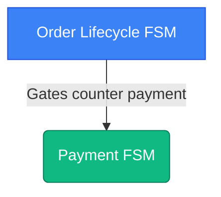
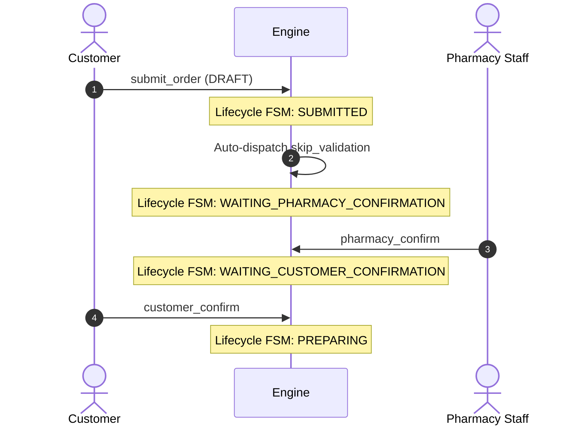
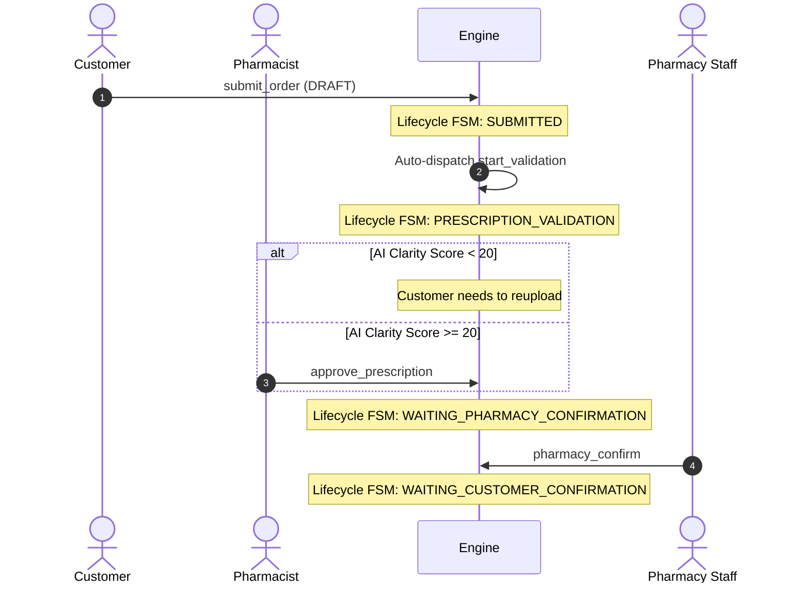

# MediPick Order Flows & Scenarios Guide (2-FSM Version)

This document serves as the guide for the MediPick Order State Machine system. It defines how Over-the-Counter (OTC), Prescription (Rx), and Mixed orders are handled by the backend engine across two Finite State Machines (FSMs).

---

## 1. Coordinated State Machine Architecture

MediPick uses **two state machines** that coordinate using cross-workflow state gates (guarded transition conditions) and dispatch actions:

---

## 2. Order Types & Flow Mechanics

### A. Over-the-Counter (OTC) Orders
OTC orders bypass clinical validation. The workflow proceeds immediately to pharmacy availability evaluation.

1. **Submission**: Order starts at `DRAFT`. Customer triggers `submit_order`. The lifecycle moves to `SUBMITTED`.
2. **Auto-Notification**: Because there is no prescription, the engine fires `skip_validation` automatically, matching rule `OL-002B` (`order_type == "OTC"`). The state transitions to `WAITING_PHARMACY_CONFIRMATION`.
3. **Pharmacy Confirmation**: Staff calls `pharmacy_confirm` to verify stock availability and moves the order to `WAITING_CUSTOMER_CONFIRMATION`.
4. **Checkout**: The customer confirms the quote (`customer_confirm`), moving the lifecycle to `PREPARING` and triggering payment online.

---

### B. Prescription (Rx) Orders
Prescription orders must pass clinical validation by a licensed pharmacist before the pharmacy staff evaluates availability.

1. **Submission**: Cart submission sets `ORDER_LIFECYCLE` to `SUBMITTED`, and automatically triggers `start_validation` on the `ORDER_LIFECYCLE` FSM, landing it at `PRESCRIPTION_VALIDATION`.
2. **Review & Approval**: Pharmacist reviews and calls `approve_prescription`. This transitions `ORDER_LIFECYCLE` to `WAITING_PHARMACY_CONFIRMATION`.
3. **Fulfillment**: From this point, it follows the OTC flow.
