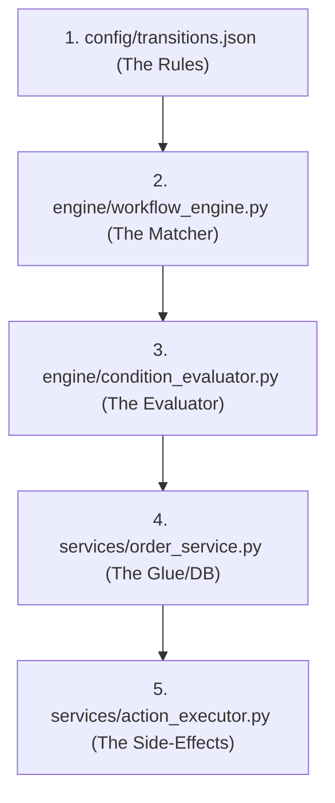

# MediPick System Architecture & Code Walkthrough Guide (2-FSM Version)

This document provides a detailed technical reference for developers, architects, and stakeholders to understand the structure, execution lifecycle, and coding patterns of the **MediPick Unified Order Engine**.

---

## 1. System Design & Philosophy

The system's core design philosophy is **Configuration over Code (Declarative Architecture)**.

Instead of writing complex, nested, and hard-to-maintain `if/else` branching logic inside Python code, we define all business logic, authorization rules, states, transitions, validation conditions, and side effects within a single JSON blueprint: [transitions.json](file:///c:/Users/KINGSLEY/Desktop/order-state-machine-demo/config/transitions.json).

### The Two Coordinated FSMs
The engine coordinates two cooperating Finite State Machines (FSMs) concurrently:
1. **`ORDER_LIFECYCLE`**: Tracks the master status of the order (`DRAFT` ➔ `SUBMITTED` ➔ `PRESCRIPTION_VALIDATION` ➔ `WAITING_PHARMACY_CONFIRMATION` ➔ `WAITING_CUSTOMER_CONFIRMATION` ➔ `PREPARING` ➔ `READY_FOR_PICKUP` ➔ `COMPLETED` / `CANCELLED` / `CLOSED` / `ISSUE_REPORTED` / `UNDER_REVIEW` / `RESOLVED` / `REJECTED`).
2. **`PAYMENT`**: Handles payment states (`UNPAID` ➔ `PAID` / `REFUNDED`).

---

## 2. Technology Stack

### Backend Technologies
* **Python 3.x**: Core language.
* **FastAPI**: Modern, fast web framework for building APIs.
* **Uvicorn**: Lightweight, lightning-fast ASGI server.
* **Pydantic**: Structural type annotations and input schema validation.
* **InMemory Database**: Simple stateful memory store ([memory_store.py](file:///c:/Users/KINGSLEY/Desktop/order-state-machine-demo/storage/memory_store.py)) representing the active DB.

### Frontend Technologies
* **React 19**: Modern UI framework using Hooks and state orchestration.
* **Vite**: Ultra-fast frontend build tool and dev server.
* **Tailwind CSS & Shadcn UI**: Styling system and reusable UI component primitives.
* **ReactFlow**: Library for building node-based interactive workflow graph visualizations.
* **Framer Motion**: Smooth transition animations and state micro-animations.

---

## 3. How to Read the Code (Step-by-Step)

### Step 1: Open [config/transitions.json](file:///c:/Users/KINGSLEY/Desktop/order-state-machine-demo/config/transitions.json)
This file defines the states and transitions. Look at a transition block:
* Notice how it specifies the required `current_state` and matching `event`.
* Look at the `allowed_roles` checking who can trigger it.
* Look at `conditions`: these must evaluate to `True` for the transition to occur.
* Look at `actions`: these are side-effects dispatched upon success.

### Step 2: Open [engine/workflow_engine.py](file:///c:/Users/KINGSLEY/Desktop/order-state-machine-demo/engine/workflow_engine.py)
This is the machine itself.
* **`execute_transition_with_reasons`**: Searches the configured workflows for a transition matching the active state and incoming event.
* **Role Check**: Calls `_is_role_allowed` to match the user's role claim against configured role permissions.
* **Condition Delegation**: Passes transition condition objects to the `ConditionEvaluator`.

### Step 3: Open [engine/condition_evaluator.py](file:///c:/Users/KINGSLEY/Desktop/order-state-machine-demo/engine/condition_evaluator.py)
This is where variables are checked.
* **`evaluate_detailed`**: Iterates through each condition from the JSON config.
* **`get_nested_value`**: Uses dot-notation paths (e.g., `states.ORDER_LIFECYCLE` or `context.payment.status`) to extract actual values from the order context.

### Step 4: Open [services/order_service.py](file:///c:/Users/KINGSLEY/Desktop/order-state-machine-demo/services/order_service.py)
This file orchestrates the workflow logic with persistent storage.
* **State-First Commits**: It updates the state dictionary (`order["states"][wf_name] = next_state`) **prior** to running external side effects to maintain transactional integrity.
* **Policy Hook**: Invokes the `PolicyEngine` to run custom cancellation and dispute rules.

### Step 5: Open [services/action_executor.py](file:///c:/Users/KINGSLEY/Desktop/order-state-machine-demo/services/action_executor.py)
This executes side-effect commands:
* **`CREATE_RESERVATION`**: Reserves inventory.
* **`REFUND_PAYMENT`**: Issues digital payment refund requests.
* **`CREATE_REPLACEMENT_ORDER`**: Spawns a brand new linked replacement order automatically.
* **`DISPATCH_EVENT`**: Triggers a separate internal event cascade.
