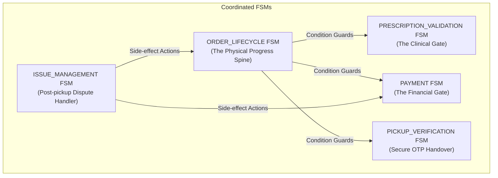
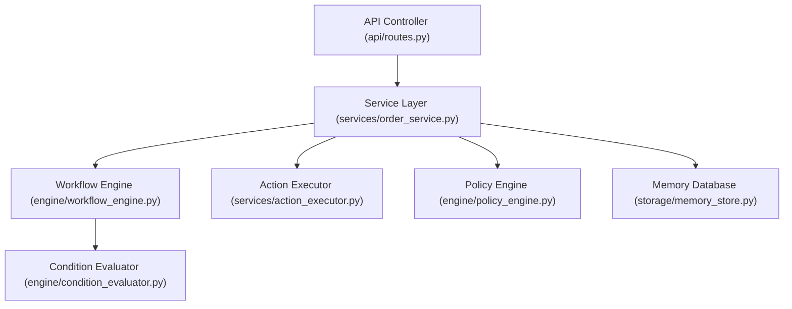
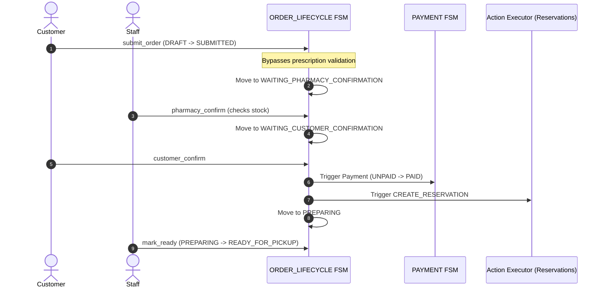
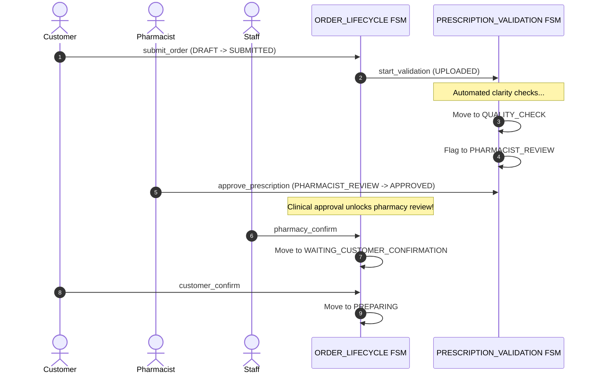
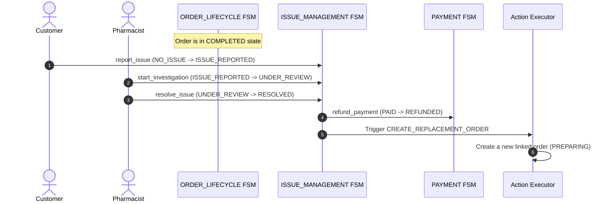

# MediPick System Architecture & Coordinated FSM Design Guide

This document provides a detailed technical reference explaining the architecture, design patterns, and engineering choices of the **MediPick Unified Order Engine**. It serves as a master reference to explain why this system is designed using coordinated sub-workflows instead of a monolithic state machine, how the data flows, and the business rationale behind every state transition.

---

## 1. Monolithic vs. Coordinated Multi-FSM Architecture (The "Why")

In many enterprise order systems, developers model the entire lifecycle as a single monolithic state machine. However, for a complex pharmacy platform like MediPick, this pattern creates a high-maintenance, rigid code structure.

### Why Not a Monolithic FSM? (The Anti-Pattern)
If we combine all concerns (Order Lifecycles, Prescription Approvals, Payments, Counter Handovers, and Support Issues) into a single state machine, we face the following issues:

1. **State Explosion:**
   Every possible state combination requires its own unique, named state.
   * *Example:* If we want to represent that the customer paid but the prescription is still under review, we need a state like `SUBMITTED_PAID_PRESCRIPTION_PENDING`. If we want to represent that the order is ready, paid, but has a dispute, we need `READY_PAID_DISPUTE_OPEN`.
   * With just 9 order lifecycle states, 4 payment states, 6 prescription states, and 4 pickup states, the total combinations grow to $9 \times 4 \times 6 \times 4 = 864$ possible states!
2. **Rigid & Unmaintainable Transitions:**
   Adding a single state (e.g., a new verification method or payment status) requires rewriting the transition rules for almost all other states.
3. **Tight Coupling:**
   A payment gateway failure could block a clinical prescription approval because they are tied together in the same transition pipeline.

### Why Coordinated FSMs? (The MediPick Solution)
MediPick decomposes the order entity into **five independent, decoupled workflows** that run in parallel.

#### The Advantages of Coordinated FSMs:
* **Single Responsibility Principle:** Each FSM manages one specific business subdomain. The `PAYMENT` FSM is only concerned with money; the `PRESCRIPTION_VALIDATION` FSM is only concerned with clinical safety.
* **Separation of Concerns:** A change to payment systems or the introduction of a new verification method (e.g. barcode scan) only updates its specific FSM without impacting other workflows.
* **Modular UI:** The frontend React components can render decoupled widgets. For example, a payment status box listens to `PAYMENT`, while the counter check-in code listens to `PICKUP_VERIFICATION`.
* **Declarative JSON Configuration:** Relationships and conditions are configured as data in a single file ([transitions.json](file:///c:/Users/KINGSLEY/Desktop/order-state-machine-demo/config/transitions.json)) rather than hardcoded in Python code.

---

## 2. Core Architectural Layers

The backend follows a clean, decoupled layer structure, routing requests from the HTTP controller to the core declarative workflow engine.

### Layer 1: Declarative Configuration (`config/transitions.json`)
The system's "source of truth". All state machines, valid transitions, allowed actor roles (RBAC), condition rules, and side-effects are defined in this single JSON file. It decouples business rules from the execution code.

### Layer 2: API Controller (`api/routes.py`)
Handles HTTP requests. It maps scenario loading, transition execution, and context updates to the service layer. It does not contain any state machine logic.

### Layer 3: Service Layer (`services/order_service.py`)
Orchestrates application workflow:
1. Builds the runtime context, including checking customer preferences (like `accept_substitutes`) and computing derived data (like overall catalogue item availability).
2. Executes transitions in a transaction-safe manner: it updates the state dictionary (`order["states"]`) **prior** to dispatching side-effect actions.
3. Invokes the policy engine.

### Layer 4: Workflow Engine (`engine/workflow_engine.py`)
The pattern matcher. It searches the JSON configuration for a transition matching the active state and incoming event. It checks:
* **Actor Role Authorization:** Ensures the user role matches the transition's `allowed_roles`.
* **Condition Evaluation:** Sends condition arrays to the evaluation engine.

### Layer 5: Condition Evaluator (`engine/condition_evaluator.py`)
Uses dot-notation (e.g., `states.PRESCRIPTION_VALIDATION` or `context.preferences.accept_substitutes`) to extract live values from the order context and compare them using operators (`equals`, `in`, `within_hours`, etc.).

### Layer 6: Action Executor (`services/action_executor.py`)
Runs asynchronous or secondary side-effect actions dispatched by the transitions, such as creating stock reservations, updating payment gateway mock statuses, removing items from carts, and spawning replacement orders.

---

## 3. Order Flow Sequence Diagrams

### 1. OTC (Over-the-Counter) Order Flow
For orders containing only OTC items, prescription validation is automatically bypassed.

### 2. Prescription & Mixed Order Flow
For orders requiring a prescription, the clinical validation gate is enforced first.

### 3. Post-Pickup Issue & Replacement Flow
If an issue is reported after the order has been completed, the issue management workflow takes over.

---

## 4. Business Rules & States Rationale

1. **Why do we have `WAITING_CUSTOMER_CONFIRMATION`?**
   * **Quote Approval:** If the pharmacy proposes brand substitutions or items are unavailable, the final cost change must be confirmed by the customer.
   * **Checkout Preference Integration:** The customer can tick the "Accept Brand Substitutes" checkbox. While this gives the pharmacy authorization to replace items, the customer still performs a final confirmation step to approve the quote before making the payment.
   * **Auto-Expiration:** If the customer does not confirm within the allowed timeline, the order is cancelled to avoid locking pharmacy stock.

2. **Why does payment happen before `PREPARING`?**
   * Preparing medicines requires decanting, labeling, and clinical packaging. This costs pharmacist labor and uses up physical stock. Payment authorization occurs prior to preparation to prevent financial losses from no-shows.

3. **Why does `PICKUP_VERIFICATION` require a separate FSM?**
   * Medicine handover is a legally critical step. An OTP-based verification FSM ensures the customer picking up the medicine matches the buyer, preventing fraud or incorrect dispensing. Keeping it in a separate FSM makes it easy to add face-verification or ID-scanner steps later.

4. **Why is `ISSUE_MANAGEMENT` decoupled?**
   * Once an order reaches the terminal `COMPLETED` state, the main lifecycle is frozen. Using a separate FSM allows the system to run dispute-resolution processes (refunds and linked replacement orders) without reopening the main order workflow.
